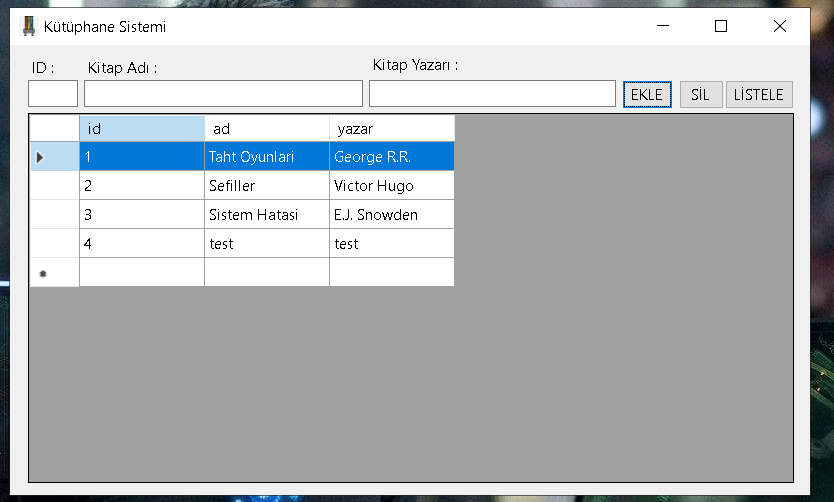

# KitaplıkAPP
LocalDB ile oluşturulmuş basit bir Windows Forms uygulamasıdır.
 
# 1 - İlgili satırdakı "AttachDBFileName" yolunu kendinize göre değiştiriniz. Sizde bu yol farklı olacaktır.

# 2 - Veri bağlantısı proje ile ilişkilendirildi

# 3 -LocalDB oluşturuldu.

# 4 - Form tasarımı yapıldı.

# 5 - Veri ekleme kodu yazıldı.

# 6 - Veri silme kodu yazıldı.

# 7 - Tüm verileri listeleme kodu yazıldı.

# 8 - LocalDB çıktıları.

# 9 - Form açılışı silme fonksiyonu bilgilendirmesi.

# 10 - Veri listeleme fonksiyonu.

# 11 - Veri ekleme fonksiyonu.

# 12 - Veri silme fonksiyonu.

